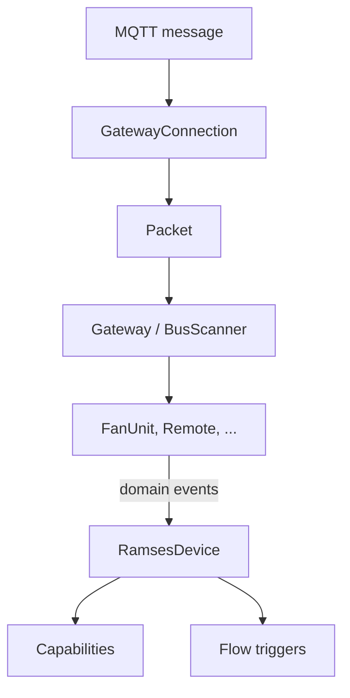

# Development
{: .no_toc }

Contributing to the app, or adapting it yourself.
{: .fs-6 .fw-300 }

<details open markdown="block">
  <summary>On this page</summary>
  {: .text-delta }
1. TOC
{:toc}
</details>

---

## Getting started

You need [Node.js 22](https://nodejs.org/), the Homey CLI and, for `homey app run`, Docker.

```bash
npm install
```

| Command | What it does |
|---|---|
| `npm test` | Tests only |
| `npm run check` | Lint, type check, tests with coverage and manifest validation, exactly what CI runs |
| `npm run lint:fix` | Fix lint errors automatically |
| `homey app run` | Run the app on your Homey temporarily, with live logs |
| `homey app install` | Install the app on your Homey permanently |

CI requires at least **85 % lines**, **80 % branches** and **85 % functions** coverage over `lib/`.

## Structure

The code is organised in layers. Everything below `lib/homey` runs under plain `node --test`, without Homey.

```text
lib/
  ramses/    protocol: Packet, decoders per code, commands, brand schemes, BusScanner, binding
  mqtt/      connection: BrokerConfig, GatewayConnection, BrokerProbe
  domain/    models: Gateway, FanUnit, Remote, ClimateSensor, VirtualSensor, events
  homey/     adapters: GatewayRegistry, capabilities, flow cards, pairing, web API
drivers/     thin Homey drivers and devices
settings/    the bus view
widgets/     the dashboard widget
```



Dependencies (MQTT `connect`, clock, timers, send function) are **injected**. That way the tests drive the whole
chain with fakes, from an MQTT message to a flow trigger.

## A new brand or a new code

- **Brand**: add a `FanScheme` in `lib/ramses/FanScheme.js` and a value to the *Brand* dropdown in
  `drivers/fan/driver.settings.compose.json`.
- **Message code**: add a decoder in `lib/ramses/decoders.js` and, if it yields a new reading, a binding in
  `lib/homey/ReadingCapabilities.js`.
- Write a test with a **real frame** from the bus.

## Translations

The app is bilingual (English and Dutch). Texts are in `locales/en.json` and `locales/nl.json`, and in the
`*.compose.json` files. Homey placeholders are `__id__`, not `{{id}}`.

## This documentation

The site lives in `docs/` and is built by GitHub Pages with the [Just the Docs](https://just-the-docs.com/) theme.
The English pages are at the root, the Dutch ones in `docs/nl/`. View it locally:

```bash
cd docs && bundle exec jekyll serve
```

To publish: *Settings → Pages → Deploy from a branch → `main` / `/docs`*.
