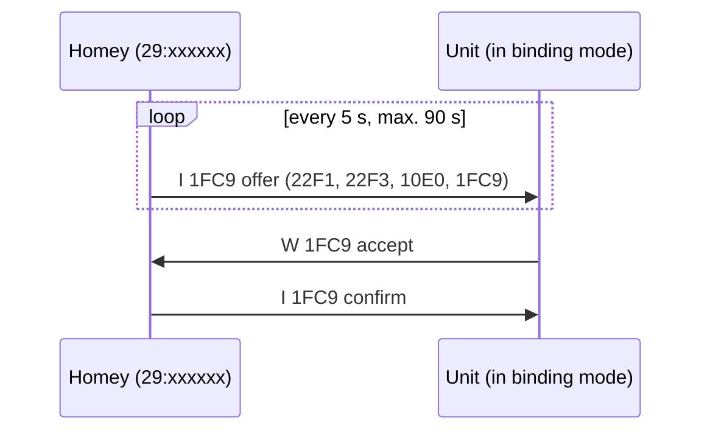

# The RAMSES II protocol
{: .no_toc }

Technical background for those who want to use the [gateway flow cards](flows#gateway) or the
[frame form](dashboard#sending-a-frame).
{: .fs-6 .fw-300 }

<details open markdown="block">
  <summary>On this page</summary>
  {: .text-delta }
1. TOC
{:toc}
</details>

---

## A frame

Every packet on the bus is one line of text:

```text
 I --- 29:173894 29:233244 --:------ 22F1 003 000304
```

| Part | Example | Meaning |
|---|---|---|
| Verb | ` I` | `I` inform, `RQ` request, `RP` reply, `W` write |
| Sequence number | `---` | Usually empty |
| Address 1 | `29:173894` | Sender |
| Address 2 | `29:233244` | Receiver (`--:------` = nobody in particular) |
| Address 3 | `--:------` | Sometimes the sender again (for broadcasts) |
| Code | `22F1` | Kind of message |
| Length | `003` | Number of bytes in the payload |
| Payload | `000304` | The content, in hex |

Over MQTT the ramses_esp wraps every frame as JSON: `{"msg": " I --- 29:173894 ..."}`. On `rx` the signal strength
(RSSI) comes along too.

## Important codes

| Code | Name | Sent by | Content |
|---|---|---|---|
| `22F1` | Fan mode | Remote → unit | `00 RR SS`: RR = mode, SS = brand-specific suffix (04, 06, 0A) |
| `22F3` | Boost / timer | Remote → unit | `00 UU DD`: DD minutes (UU 00) or hours (UU 01). Orcon uses a long form. |
| `22F7` | Bypass | Homey → unit | `00 MM EF`: auto, open or closed |
| `31D9` | Fan state | Unit | Mode or speed; see below |
| `31DA` | Extended status | Unit | CO₂, humidity, temperatures, air flow, bypass, filter, faults |
| `10D0` | Filter | Unit / remote | Days until replacement; `W 10D0 00FF` resets the counter |
| `10E0` | Device info | All | Manufacturer and model, e.g. `VMC-15RP01` |
| `1298` | CO₂ | Sensor | ppm |
| `12A0` | Humidity | Sensor / unit | % (sometimes with temperature) |
| `31E0` | Ventilation demand | CO₂ sensor | % |
| `2E10` | Presence | Sensor | |
| `1060` | Battery | Remote / sensor | Level and *battery low* |
| `2411` | Parameter | Unit ↔ Homey | Reading (`RQ`) and writing (`W`) heat recovery parameters |
| `1FC9` | Binding | All | Offer, accept, confirm |

## Modes per brand

The same number in `22F1` means something different per brand:

| Byte | Orcon | Itho | Vasco / ClimaRad |
|---|---|---|---|
| `00` | away | off | off |
| `01` | low | away | away |
| `02` | medium | low | low |
| `03` | high | medium | medium |
| `04` | auto | high | high |
| `05` | auto | | auto |
| `07` | off | | |

That's why the unit has a [Brand](ventilation-unit#brand) setting. The tables follow
[ramses_rf](https://github.com/zxdavb/ramses_rf); the Orcon one is confirmed on a real unit.

## `31D9`: mode or speed?

- With status byte `FF` the value is a **speed** in half percent.
- With status byte `00` (seen live as `000000` to `000004`) it's a **step number**.
- **Orcon** reports its **mode** in byte 2 (00 away, 01 low, 02 medium, 03 high, 04 auto), not a speed.

## Binding (`1FC9`)



Homey picks a free address that doesn't appear on the bus yet: `29:` as a remote, `37:` as a CO₂ sensor. When you
start binding from a unit, only the answer of *that* unit counts.

## Echoes

The ramses_esp hears its own transmissions back. Homey recognises them as an **echo**: they don't count as a remote
button press and they're marked in the bus view. A flow that controls the unit therefore never fires its own trigger.

## Further reading

- [ramses_rf](https://github.com/zxdavb/ramses_rf): the Python library much of this knowledge comes from
- [ramses_esp](https://github.com/IndaloTech/ramses_esp): the gateway firmware
- [ramses_cc](https://github.com/zxdavb/ramses_cc): the Home Assistant integration
