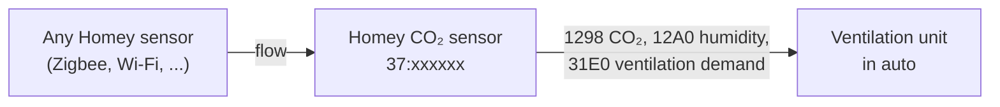

# The Homey CO₂ sensor
{: .no_toc }

Let your ventilation unit respond to any CO₂ or humidity sensor in Homey, as if it were an original RAMSES sensor.
{: .fs-6 .fw-300 }

<details open markdown="block">
  <summary>On this page</summary>
  {: .text-delta }
1. TOC
{:toc}
</details>

---

## Why?

A unit in **auto mode** ventilates harder as its sensors ask for more. But maybe you already have a Netatmo, Aqara,
Airthings or Zigbee sensor in the bedroom and no RAMSES sensor. With the **Homey CO₂ sensor**, Homey itself plays a
RAMSES CO₂ sensor (`37:xxxxxx`) and forwards the values of your Homey sensors to the unit. The unit then regulates
itself, in its own auto mode.



## Adding and binding

1. Go to **Devices → + → RAMSES ESP → Homey CO₂ sensor**. Homey picks a free address on the bus.
2. Put the unit in **binding mode** (Orcon: unplug and plug back in; you then have 2 minutes).
3. Open the Homey CO₂ sensor → **Settings** → **Maintenance** → **Bind to a unit**.
4. Homey offers itself as a sensor (see below). Once accepted, the unit's address is shown under
   *Bound to unit*.

{: .note }
Homey sends two offers in turn, every 5 seconds: first as a *control*, like an Orcon CO2 15RF, then as a *plain
sensor* (`31E0`, `1298`, `2E10`). The unit accepts the one it knows. Orcon units accept the first; other brands
may accept the second. Only Orcon has been verified so far.

### What binding looks like on the bus

Verified on an Orcon VMC-15RP01 that already had a CO2 15RF bound. Homey plays sensor `37:215483`, the unit is
`29:233244`:

```text
 I --- 37:215483 --:------ 37:215483 1FC9 024 0022F19749BB0022F39749BB6710E09749BB001FC99749BB   Homey offers
 W --- 29:233244 37:215483 --:------ 1FC9 006 0031D9778F1C                                       the unit accepts
 I --- 37:215483 29:233244 --:------ 1FC9 001 00                                                 Homey confirms
```

The unit answered within a second of the first offer. Right after, Homey's reports reach the unit:

```text
 I --- 37:215483 --:------ 37:215483 1298 003 000229              CO₂ 553 ppm
 I --- 37:215483 29:233244 --:------ 31E0 008 0000260001002600    ventilation demand 19 %
```

{: .note }
The demand goes in the **first** group of the `31E0` (`00 00 DD 00`), in half percent. An Orcon CO2 15RF raises
and lowers that group with the CO₂ level; the second group (`01 00 DD 00`) does not drive the unit. Version 1.0.0
put the demand only in the second group, and the unit did not respond: verified with 100 % in either form on the
same unit.

You can follow this yourself in the [bus view](dashboard#bus-view). Only the unit you expect should answer with the
`W 1FC9`; a neighbour's unit only does when it is in binding mode at the same moment.

{: .warning }
A unit remembers bound devices. Unbinding usually means resetting all bindings on the unit (see its manual) and
then binding your other remotes and sensors again. The existing sensors stay bound when you add the Homey sensor.

## Passing on values with flows

The sensor has three action cards:

| Card | What it does |
|---|---|
| **Report [ppm] ppm CO₂** | Sends a CO₂ value (`1298`) to the unit. |
| **Report [%] % humidity** | Sends a humidity (`12A0`) to the unit. |
| **Ask the unit for [%] % ventilation** | Sends a ventilation demand (`31E0`) directly. |

A typical flow:

> **When** the CO₂ of *Netatmo bedroom* changed<br>
> **Then** *Homey CO₂ sensor*: Report **[CO₂ token]** ppm CO₂

Do the same for the humidity of, for example, the bathroom sensor.

Homey **repeats the last values every 5 minutes**, as a real sensor does. So if no new value arrives for a while, the
unit doesn't consider the sensor gone.

## Calculating the ventilation demand

Under *Settings → Ventilation demand* you decide how the sensor calculates its demand.

| Setting | Default | Meaning |
|---|---|---|
| **Derive from CO₂ and humidity** | on | Homey calculates the ventilation demand itself from the reported values. Off: only the card *Ask for ventilation* sets the demand. |
| **CO₂ from** | 400 ppm | Below this value the demand is 0 %. |
| **CO₂ full demand at** | 1000 ppm | From here the demand is 100 %. |
| **Humidity from** | 60 % | Below this value the demand is 0 %. |
| **Humidity full demand at** | 80 % | From here the demand is 100 %. |

Between the low and the high point the demand rises **linearly**. Of CO₂ and humidity, **the higher one** counts.

**Example** with the defaults: 700 ppm CO₂ gives (700 − 400) / (1000 − 400) = **50 %**. 65 % humidity gives
(65 − 60) / (80 − 60) = **25 %**. The sensor therefore asks for 50 %.

## What the sensor shows

| Capability | |
|---|---|
| CO₂ | The last reported CO₂ |
| Humidity | The last reported humidity |
| Ventilation demand | What the sensor is asking the unit for now |

Under *Settings → Bus* you find the address Homey plays and the unit the sensor is bound to.

{: .tip }
The unit has to be in **Auto** to respond to the ventilation demand. Set it to low or high manually and it ignores
sensors until you set it back.
