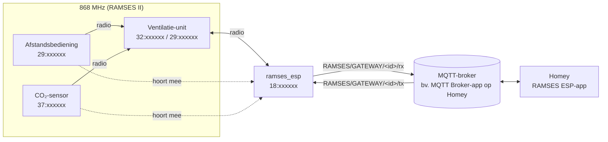

# RAMSES ESP voor Homey
{: .fs-9 }

Haal je WTW- of ventilatie-unit van Orcon, Itho, Vasco of ClimaRad in Homey. Zet de stand, start een boost,
lees CO₂, vocht, temperaturen en filterstatus uit, en gebruik je bestaande afstandsbedieningen en sensoren als
triggers in flows.
{: .fs-6 .fw-300 }

[Aan de slag](installatie){: .btn .btn-primary .fs-5 .mb-4 .mb-md-0 .mr-2 }
[Bekijk op GitHub](https://github.com/starredev/homey-ramses-esp){: .btn .fs-5 .mb-4 .mb-md-0 }

---

## Wat doet de app?

Veel ventilatiesystemen in Nederland praten onderling draadloos op **868 MHz** met het **RAMSES II**-protocol:
de unit op zolder, de afstandsbediening in de keuken, de CO₂-sensor in de woonkamer. Een
[ramses_esp](https://github.com/IndaloTech/ramses_esp) is een klein ESP32-stickje met een 868 MHz-radio dat dat
verkeer afluistert en zelf berichten kan versturen. Het stuurt alles door naar een **MQTT-broker**.

Deze Homey-app maakt verbinding met die broker en maakt van wat er op de bus gebeurt gewone Homey-apparaten:

| In Homey | Wat je ermee kunt |
|---|---|
| **Ramses Gateway** | De verbinding met je ramses_esp. Ziet elk pakket op de bus en onthoudt elk apparaat dat hij hoort. |
| **Ventilatie-unit** | Stand kiezen (laag, midden, hoog, auto, afwezig), boost, bypass, filterteller, sensoren en parameters. |
| **Afstandsbediening** | Elke knopdruk op een fysieke remote wordt een flow-trigger. |
| **Sensor** | CO₂, vocht, temperatuur en batterij van ruimtesensoren. |
| **Homey CO₂-sensor** | Homey doet zich voor als CO₂-sensor, zodat je unit reageert op *elke* sensor in je huis. |

Daarnaast krijg je een **dashboardwidget** en een **busweergave** met live verkeer, een apparatenzoeker en een
formulier om zelf frames te versturen.

## Hoe hangt het samen?

Er is **geen Home Assistant**, geen extra server en geen herprogrammering van de ramses_esp nodig. De app draait
volledig lokaal op je Homey.

## Snel overzicht

1. [Zet de ramses_esp en een MQTT-broker klaar](installatie#1-de-mqtt-broker) (bv. de *MQTT Broker*-app op Homey).
2. [Installeer de app](installatie#3-de-app-installeren) op je Homey.
3. [Voeg de gateway toe](gateway): vul het adres van de broker in, Homey vindt de ramses_esp vanzelf.
4. [Voeg je ventilatie-unit toe](ventilatie-unit) en zorg dat Homey hem mag bedienen
   (via het adres van een gekoppelde remote, of door Homey zelf te [koppelen](ventilatie-unit#homey-koppelen-als-afstandsbediening)).
5. Optioneel: [remotes en sensoren](remotes-en-sensoren), de [Homey CO₂-sensor](homey-co2-sensor) en
   [flows](flows).

## Ondersteunde apparaten

De app spreekt RAMSES II, het protocol dat deze merken gemeen hebben. Merken nummeren hun standen wel verschillend;
de app herkent dat zelf of je [kiest het merk](ventilatie-unit#merk) in de instellingen.

| Merk | Status |
|---|---|
| **Orcon** (MVS-15, HRC, CO2 15RF, 15RF-remotes) | Getest op een echte installatie |
| **Itho Daalderop** (CVE, HRU met RFT-remotes) | Volgens de tabellen van ramses_rf |
| **Vasco** (D-serie) | Volgens de tabellen van ramses_rf |
| **ClimaRad** (Ventura) | Volgens de tabellen van ramses_rf |
| **Nuaire** | Alleen midden en hoog |

Werkt jouw unit anders dan verwacht? Open een [issue](https://github.com/starredev/homey-ramses-esp/issues) met
een stukje log uit de [busweergave](dashboard#busweergave).

{: .let_op }
Dit is een **onofficieel communityproject**. Het is niet gemaakt of goedgekeurd door Orcon, Itho, Vasco, ClimaRad,
Nuaire of de makers van ramses_esp. Gebruik op eigen risico.
