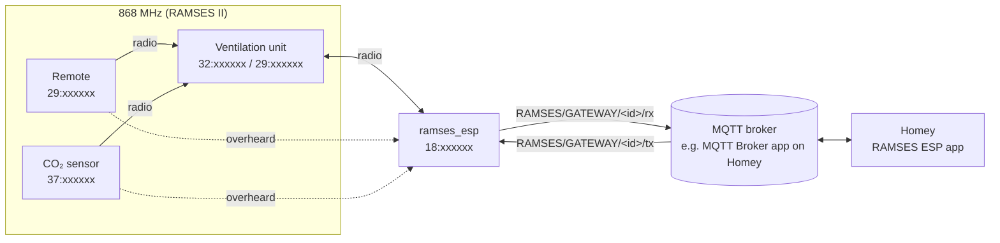

# RAMSES ESP for Homey
{: .fs-9 }

Bring your heat recovery or ventilation unit from Orcon, Itho, Vasco or ClimaRad into Homey. Set the fan mode,
start a boost, read CO₂, humidity, temperatures and filter status, and use your existing remotes and sensors as
flow triggers.
{: .fs-6 .fw-300 }

[Get started](installation){: .btn .btn-primary .fs-5 .mb-4 .mb-md-0 .mr-2 }
[View on GitHub](https://github.com/starredev/homey-ramses-esp){: .btn .fs-5 .mb-4 .mb-md-0 .mr-2 }
[Nederlands](nl/){: .btn .fs-5 .mb-4 .mb-md-0 }

---

## What does the app do?

Many ventilation systems talk to each other wirelessly on **868 MHz** using the **RAMSES II** protocol: the unit in
the attic, the remote in the kitchen, the CO₂ sensor in the living room. A
[ramses_esp](https://github.com/IndaloTech/ramses_esp) is a small ESP32 stick with an 868 MHz radio that listens to
that traffic and can send messages itself. It forwards everything to an **MQTT broker**.

This Homey app connects to that broker and turns what happens on the bus into regular Homey devices:

| In Homey | What you can do |
|---|---|
| **Ramses Gateway** | The link to your ramses_esp. Sees every packet on the bus and remembers every device it hears. |
| **Ventilation unit** | Choose the mode (low, medium, high, auto, away), boost, bypass, filter counter, sensors and parameters. |
| **Remote** | Every button press on a physical remote becomes a flow trigger. |
| **Sensor** | CO₂, humidity, temperature and battery of room sensors. |
| **Homey CO₂ sensor** | Homey poses as a CO₂ sensor and binds to your unit like a real one, so the unit responds to *any* sensor in your home. |

You also get a **dashboard widget** and a **bus view** with live traffic, a device finder and a form to send frames
yourself.

## How it fits together

No **Home Assistant**, no extra server and no reflashing of the ramses_esp needed. The app runs entirely locally on
your Homey.

## Quick overview

1. [Set up the ramses_esp and an MQTT broker](installation#1-the-mqtt-broker) (e.g. the *MQTT Broker* app on Homey).
2. [Install the app](installation#3-installing-the-app) on your Homey.
3. [Add the gateway](gateway): enter the broker address, Homey finds the ramses_esp by itself.
4. [Add your ventilation unit](ventilation-unit) and make sure Homey may control it
   (through the address of a bound remote, or by [binding Homey itself](ventilation-unit#option-2-bind-homey-as-a-remote)).
5. Optional: [remotes and sensors](remotes-and-sensors), the [Homey CO₂ sensor](homey-co2-sensor) and
   [flows](flows).

## Supported devices

The app speaks RAMSES II, the protocol these brands share. Brands do number their modes differently; the app
detects this by itself, or you [choose the brand](ventilation-unit#brand) in the settings.

| Brand | Status |
|---|---|
| **Orcon** (MVS-15, HRC, CO2 15RF, 15RF remotes) | Tested on a real installation |
| **Itho Daalderop** (CVE, HRU with RFT remotes) | Based on the tables of ramses_rf |
| **Vasco** (D series) | Based on the tables of ramses_rf |
| **ClimaRad** (Ventura) | Based on the tables of ramses_rf |
| **Nuaire** | Medium and high only |

Does your unit behave differently than expected? Open an
[issue](https://github.com/starredev/homey-ramses-esp/issues) with a piece of log from the
[bus view](dashboard#bus-view).

{: .note }
This is an **unofficial community project**. It is not made or endorsed by Orcon, Itho, Vasco, ClimaRad, Nuaire or
the authors of ramses_esp. Use at your own risk.
