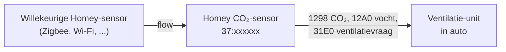

# De Homey CO₂-sensor
{: .no_toc }

Laat je ventilatie-unit reageren op elke CO₂- of vochtsensor in Homey, alsof het een originele RAMSES-sensor is.
{: .fs-6 .fw-300 }

<details open markdown="block">
  <summary>Op deze pagina</summary>
  {: .text-delta }
1. TOC
{:toc}
</details>

---

## Waarom?

Een unit in de **autostand** ventileert harder naarmate zijn sensoren meer vragen. Maar misschien heb je al een
Netatmo, een Aqara-, Airthings- of Zigbee-sensor in de slaapkamer en geen RAMSES-sensor. Met de **Homey CO₂-sensor**
speelt Homey zelf een RAMSES-CO₂-sensor (`37:xxxxxx`) en stuurt het de waarden van je Homey-sensoren door naar de
unit. De unit regelt dan zelf, in zijn eigen autostand.



## Toevoegen en koppelen

1. Ga naar **Apparaten → + → RAMSES ESP → Homey CO₂-sensor**. Homey kiest een vrij adres op de bus.
2. Zet de unit in **koppelmodus** (Orcon: stekker eruit en er weer in; daarna 2 minuten de tijd).
3. Open de Homey CO₂-sensor → **Instellingen** → **Onderhoud** → **Koppel aan een unit**.
4. Homey biedt zich aan als sensor (zie hieronder). Na het accepteren staat het adres van de unit bij
   *Gekoppeld aan unit*.

{: .let_op }
Homey stuurt om de 5 seconden om beurten twee aanbiedingen: eerst als *bediening*, zoals een Orcon CO2 15RF, dan als
*kale sensor* (`31E0`, `1298`, `2E10`). De unit accepteert de vorm die hij kent. Orcon-units nemen de eerste;
andere merken mogelijk de tweede. Tot nu toe is alleen Orcon getest.

### Hoe koppelen eruitziet op de bus

Getest op een Orcon VMC-15RP01 waaraan al een CO2 15RF gekoppeld was. Homey speelt sensor `37:215483`, de unit is
`29:233244`:

```text
 I --- 37:215483 --:------ 37:215483 1FC9 024 0022F19749BB0022F39749BB6710E09749BB001FC99749BB   Homey biedt zich aan
 W --- 29:233244 37:215483 --:------ 1FC9 006 0031D9778F1C                                       de unit accepteert
 I --- 37:215483 29:233244 --:------ 1FC9 001 00                                                 Homey bevestigt
```

De unit antwoordde binnen een seconde op het eerste aanbod. Direct daarna komen de meldingen van Homey bij de unit:

```text
 I --- 37:215483 --:------ 37:215483 1298 003 000229              CO₂ 553 ppm
 I --- 37:215483 29:233244 --:------ 31E0 008 0000000001003400    ventilatievraag
```

Je kunt dit zelf volgen in de [busweergave](dashboard#busweergave). Alleen de unit die je verwacht hoort met de
`W 1FC9` te antwoorden; een buurunit doet dat alleen als die op hetzelfde moment in koppelmodus staat.

{: .waarschuwing }
Een unit onthoudt gekoppelde apparaten. Ontkoppelen gaat meestal via een reset van alle koppelingen op de unit (zie
de handleiding), waarna je je andere remotes en sensoren opnieuw koppelt. Bestaande sensoren blijven gekoppeld als
je de Homey-sensor toevoegt.

## Waarden doorgeven met flows

De sensor heeft drie actiekaarten:

| Kaart | Wat het doet |
|---|---|
| **Meld [ppm] ppm CO₂** | Stuurt een CO₂-waarde (`1298`) naar de unit. |
| **Meld [%] % vochtigheid** | Stuurt een vochtigheid (`12A0`) naar de unit. |
| **Vraag de unit om [%] % ventilatie** | Stuurt direct een ventilatievraag (`31E0`). |

Een typische flow:

> **Als** de CO₂ van *Netatmo slaapkamer* veranderde<br>
> **Dan** *Homey CO₂-sensor*: Meld **[CO₂-tag]** ppm CO₂

Doe hetzelfde voor de vochtigheid van bijvoorbeeld de badkamersensor.

Homey **herhaalt de laatste waarden elke 5 minuten**, zoals een echte sensor. Komt er een tijdje geen nieuwe waarde
binnen, dan ziet de unit de sensor dus niet als verdwenen.

## Ventilatievraag uitrekenen

Onder *Instellingen → Ventilatievraag* bepaal je hoe de sensor zijn vraag berekent.

| Instelling | Standaard | Betekenis |
|---|---|---|
| **Uitrekenen uit CO₂ en vochtigheid** | aan | Homey berekent de ventilatievraag zelf uit de gemelde waarden. Uit: alleen de kaart *Vraag om ventilatie* zet de vraag. |
| **CO₂ vanaf** | 400 ppm | Onder deze waarde is de vraag 0 %. |
| **CO₂ volle vraag bij** | 1000 ppm | Vanaf hier is de vraag 100 %. |
| **Vochtigheid vanaf** | 60 % | Onder deze waarde is de vraag 0 %. |
| **Vochtigheid volle vraag bij** | 80 % | Vanaf hier is de vraag 100 %. |

Tussen het lage en het hoge punt loopt de vraag **lineair** op. Van CO₂ en vocht telt **de hoogste**.

**Voorbeeld** met de standaardwaarden: 700 ppm CO₂ geeft (700 − 400) / (1000 − 400) = **50 %**. 65 % vocht geeft
(65 − 60) / (80 − 60) = **25 %**. De sensor vraagt dus 50 %.

## Wat de sensor laat zien

| Capability | |
|---|---|
| CO₂ | De laatst gemelde CO₂ |
| Luchtvochtigheid | De laatst gemelde vochtigheid |
| Ventilatievraag | Wat de sensor de unit nu vraagt |

Onder *Instellingen → Bus* staan het adres dat Homey speelt en de unit waaraan de sensor gekoppeld is.

{: .tip }
De unit moet in **Auto** staan om op de ventilatievraag te reageren. Zet je hem handmatig op laag of hoog, dan
negeert hij sensoren tot je hem terugzet.
