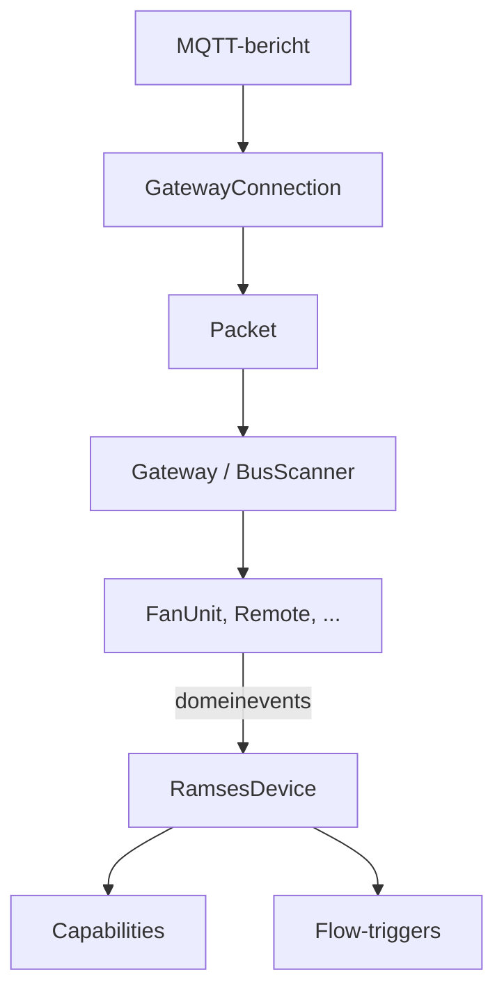

# Ontwikkelen
{: .no_toc }

Bijdragen aan de app, of hem zelf aanpassen.
{: .fs-6 .fw-300 }

<details open markdown="block">
  <summary>Op deze pagina</summary>
  {: .text-delta }
1. TOC
{:toc}
</details>

---

## Aan de slag

Je hebt [Node.js 22](https://nodejs.org/), de Homey CLI en, voor `homey app run`, Docker nodig.

```bash
npm install
```

| Commando | Wat het doet |
|---|---|
| `npm test` | Alleen de tests |
| `npm run check` | Lint, typecheck, tests met coverage en manifestvalidatie, precies wat de CI doet |
| `npm run lint:fix` | Lintfouten automatisch herstellen |
| `homey app run` | De app tijdelijk op je Homey draaien met live logs |
| `homey app install` | De app blijvend op je Homey installeren |

De CI eist minimaal **85 % regels**, **80 % branches** en **85 % functies** coverage over `lib/`.

## Opbouw

De code is in lagen opgedeeld. Alles onder `lib/homey` draait onder kale `node --test`, zonder Homey.

```text
lib/
  ramses/    protocol: Packet, decoders per code, commando's, merkschema's, BusScanner, koppelen
  mqtt/      verbinding: BrokerConfig, GatewayConnection, BrokerProbe
  domain/    modellen: Gateway, FanUnit, Remote, ClimateSensor, VirtualSensor, events
  homey/     adapters: GatewayRegistry, capabilities, flowkaarten, pairing, web-API
drivers/     dunne Homey-drivers en -devices
settings/    de busweergave
widgets/     de dashboardwidget
```



Afhankelijkheden (MQTT-`connect`, klok, timers, verstuurfunctie) worden **geïnjecteerd**. De tests drijven zo de hele
keten met nep-objecten, van een MQTT-bericht tot een flow-trigger.

## Een nieuw merk of nieuwe code

- **Merk**: voeg een `FanScheme` toe in `lib/ramses/FanScheme.js` en een waarde aan de dropdown *Merk* in
  `drivers/fan/driver.settings.compose.json`.
- **Berichtcode**: voeg een decoder toe in `lib/ramses/decoders.js` en, als hij een nieuwe meetwaarde oplevert, een
  koppeling in `lib/homey/ReadingCapabilities.js`.
- Schrijf er een test bij met een **echt frame** van de bus.

## Vertalingen

De app is tweetalig (Engels en Nederlands). Teksten staan in `locales/en.json` en `locales/nl.json`, en in de
`*.compose.json`-bestanden. Homey-placeholders zijn `__id__`, niet `{{id}}`.

## Deze documentatie

De site staat in `docs/` en wordt door GitHub Pages gebouwd met het thema
[Just the Docs](https://just-the-docs.com/). De Engelse pagina's staan in de root, de Nederlandse in `docs/nl/`. Lokaal bekijken:

```bash
cd docs && bundle exec jekyll serve
```

Voor publiceren: *Settings → Pages → Deploy from a branch → `main` / `/docs`*.
