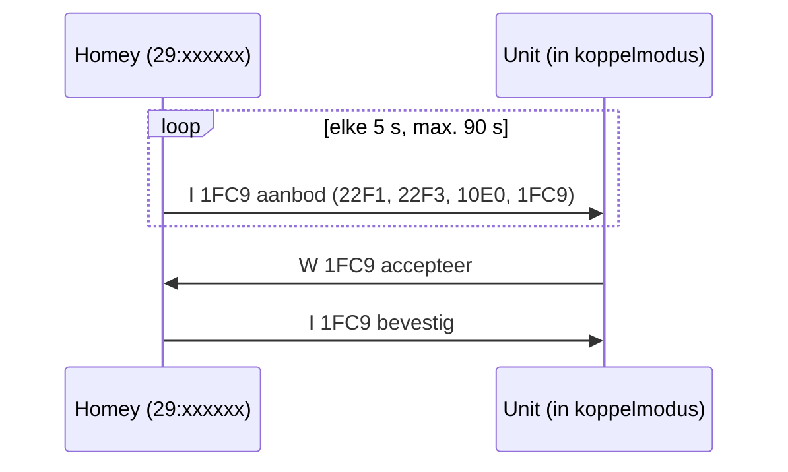

# Het RAMSES II-protocol
{: .no_toc }

Technische achtergrond voor wie de [gateway-flowkaarten](flows#gateway) of het
[frameformulier](dashboard#een-frame-versturen) wil gebruiken.
{: .fs-6 .fw-300 }

<details open markdown="block">
  <summary>Op deze pagina</summary>
  {: .text-delta }
1. TOC
{:toc}
</details>

---

## Een frame

Elk pakket op de bus is één regel tekst:

```text
 I --- 29:173894 29:233244 --:------ 22F1 003 000304
```

| Deel | Voorbeeld | Betekenis |
|---|---|---|
| Werkwoord | ` I` | `I` melden, `RQ` opvragen, `RP` antwoord, `W` schrijven |
| Volgnummer | `---` | Meestal leeg |
| Adres 1 | `29:173894` | Afzender |
| Adres 2 | `29:233244` | Ontvanger (`--:------` = niemand in het bijzonder) |
| Adres 3 | `--:------` | Soms nogmaals afzender (bij uitzendingen) |
| Code | `22F1` | Soort bericht |
| Lengte | `003` | Aantal bytes in de payload |
| Payload | `000304` | De inhoud, in hex |

Via MQTT verpakt de ramses_esp elk frame als JSON: `{"msg": " I --- 29:173894 ..."}`. Op `rx` komt ook de
signaalsterkte (RSSI) mee.

## Belangrijke codes

| Code | Naam | Wie stuurt het | Inhoud |
|---|---|---|---|
| `22F1` | Ventilatiestand | Remote → unit | `00 RR SS`: RR = stand, SS = merkspecifiek slot (04, 06, 0A) |
| `22F3` | Boost / timer | Remote → unit | `00 UU DD`: DD minuten (UU 00) of uren (UU 01). Orcon gebruikt een lange vorm. |
| `22F7` | Bypass | Homey → unit | `00 MM EF`: auto, open of dicht |
| `31D9` | Ventilatorstatus | Unit | Stand of snelheid; zie hieronder |
| `31DA` | Uitgebreide status | Unit | CO₂, vocht, temperaturen, debiet, bypass, filter, storingen |
| `10D0` | Filter | Unit / remote | Dagen tot vervanging; `W 10D0 00FF` zet de teller terug |
| `10E0` | Apparaatinfo | Alle | Fabrikant en type, bv. `VMC-15RP01` |
| `1298` | CO₂ | Sensor | ppm |
| `12A0` | Vochtigheid | Sensor / unit | % (soms met temperatuur) |
| `31E0` | Ventilatievraag | CO₂-sensor | % |
| `2E10` | Aanwezigheid | Sensor | |
| `1060` | Batterij | Remote / sensor | Niveau en *bijna leeg* |
| `2411` | Parameter | Unit ↔ Homey | Lezen (`RQ`) en schrijven (`W`) van WTW-parameters |
| `1FC9` | Koppelen | Alle | Aanbieden, accepteren, bevestigen |

## Standen per merk

Hetzelfde getal in `22F1` betekent per merk iets anders:

| Byte | Orcon | Itho | Vasco / ClimaRad |
|---|---|---|---|
| `00` | afwezig | uit | uit |
| `01` | laag | afwezig | afwezig |
| `02` | midden | laag | laag |
| `03` | hoog | midden | midden |
| `04` | auto | hoog | hoog |
| `05` | auto | | auto |
| `07` | uit | | |

Daarom heeft de unit een instelling [Merk](ventilatie-unit#merk). De tabellen volgen
[ramses_rf](https://github.com/zxdavb/ramses_rf); die van Orcon is bevestigd op een echte unit.

## `31D9`: stand of snelheid?

- Met statusbyte `FF` is de waarde een **snelheid** in halve procenten.
- Met statusbyte `00` (live gezien als `000000` t/m `000004`) is het een **standnummer**.
- **Orcon** meldt in byte 2 zijn **stand** (00 afwezig, 01 laag, 02 midden, 03 hoog, 04 auto) en geen snelheid.

## Koppelen (`1FC9`)



Homey kiest een vrij adres dat nog niet op de bus voorkomt: `29:` als remote, `37:` als CO₂-sensor. Als je de
koppeling vanaf een unit start, telt alleen het antwoord van *die* unit.

## Echo's

De ramses_esp hoort zijn eigen uitzendingen terug. Homey herkent die als **echo**: ze tellen niet als knopdruk van een
remote en ze staan gemarkeerd in de busweergave. Een flow die de unit bedient, start dus nooit zijn eigen trigger.

## Meer lezen

- [ramses_rf](https://github.com/zxdavb/ramses_rf): de Python-bibliotheek waar veel van deze kennis vandaan komt
- [ramses_esp](https://github.com/IndaloTech/ramses_esp): de gatewayfirmware
- [ramses_cc](https://github.com/zxdavb/ramses_cc): de Home Assistant-integratie
